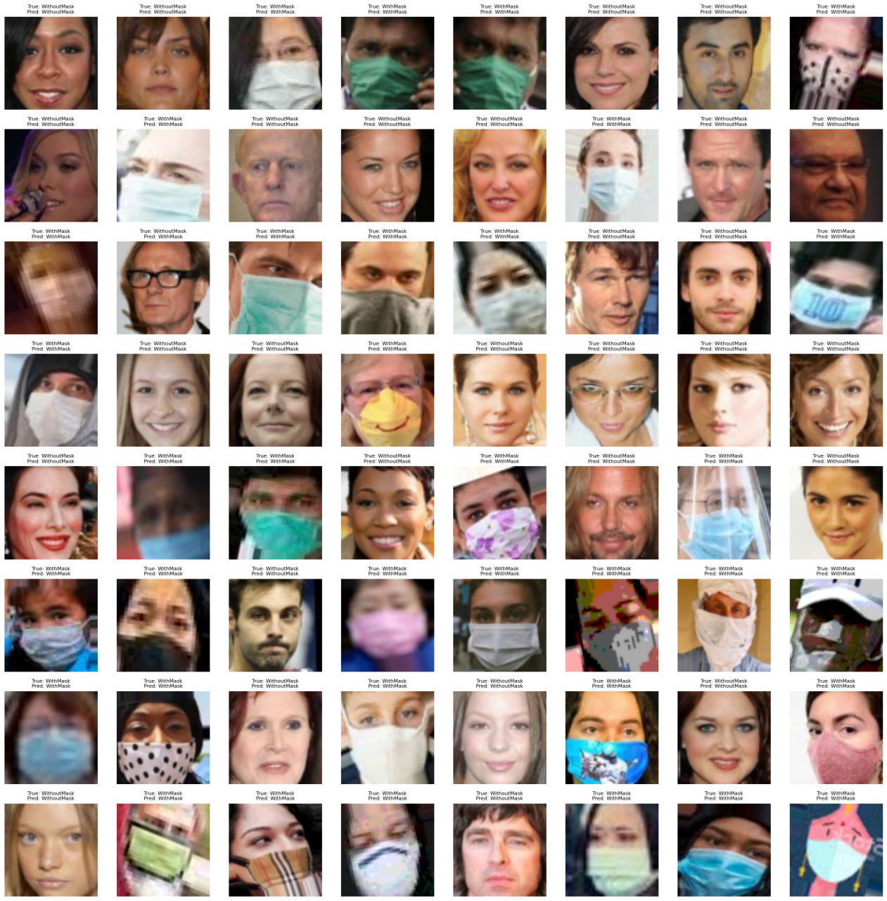

# Face Mask Detection ~12K Images Dataset
Original notebook:
https://colab.research.google.com/drive/1drUwhElli8JvB5_u34lu8DlPJVlHcQ-w

About Dataset
Context
This dataset is used for Face Mask Detection Classification with images. The dataset consists of almost 12K images which are almost 328.92MB in size.

Acknowledgments
All the images with the face mask (~6K) are scrapped from google search and all the images without the face mask are preprocessed from the CelebFace dataset created by Jessica Li. Thank you so much Jessica for providing a wonderful dataset to the community.

Inspiration
The inspiration behind creating this dataset is to create an algorithm that can directly detect is a person is wearing a face mask or not. So I've scrapped the images from google as well as from the CelebFace dataset created by Jessica Li to make this happen.
https://www.kaggle.com/datasets/ashishjangra27/face-mask-12k-images-dataset

