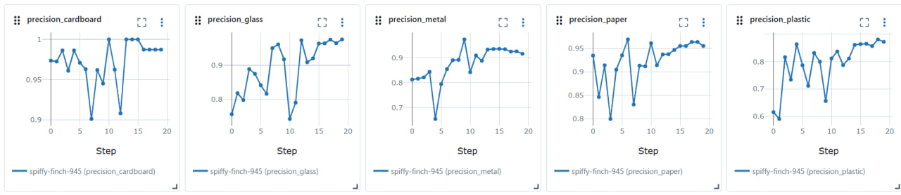
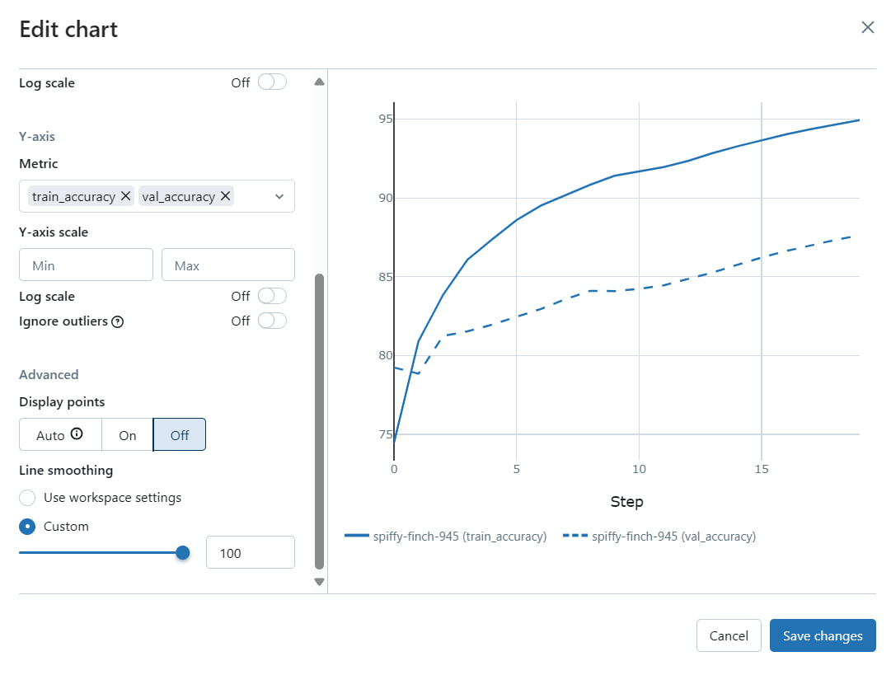
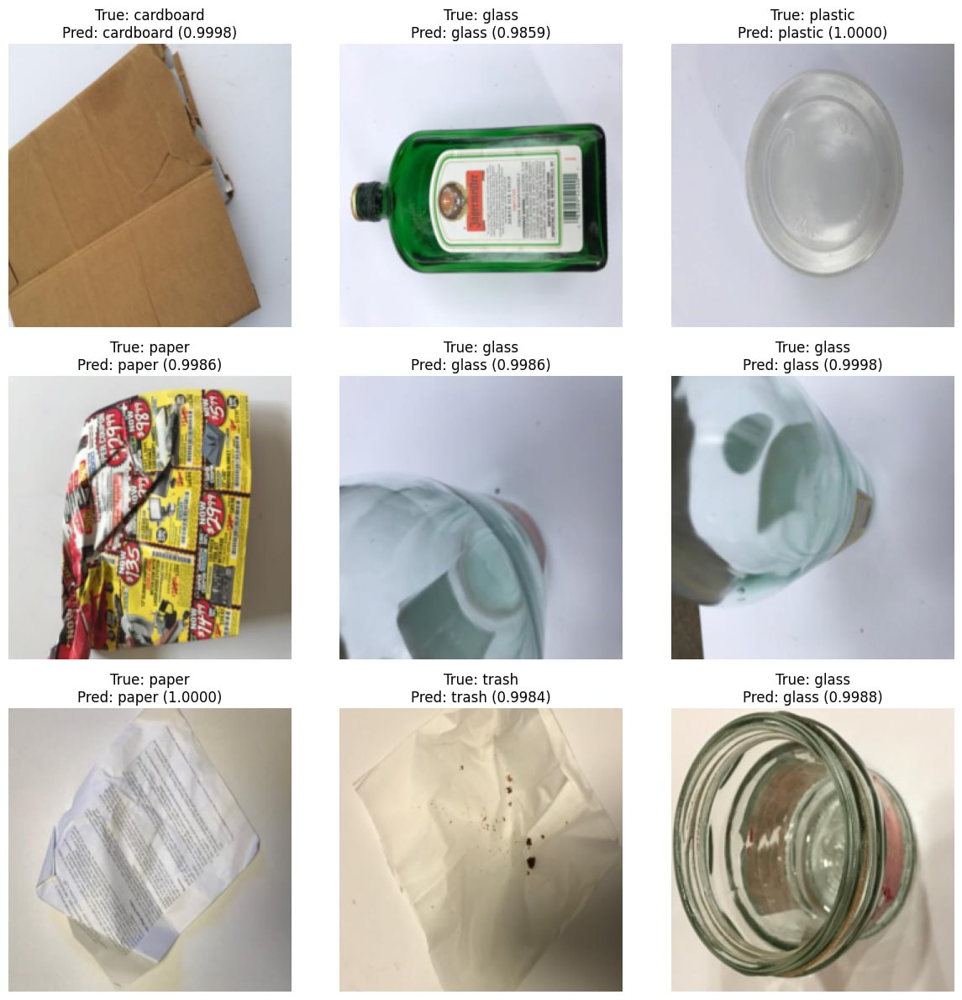

# About Dataset
Garbage Classification Data
The Garbage Classification Dataset contains 6 classifications: cardboard (393), glass (491), metal (400), paper(584), plastic (472) and trash(127).
# MLFlow 
## Precision metrics for all classes

## Test and validation accuracy

## Inference

